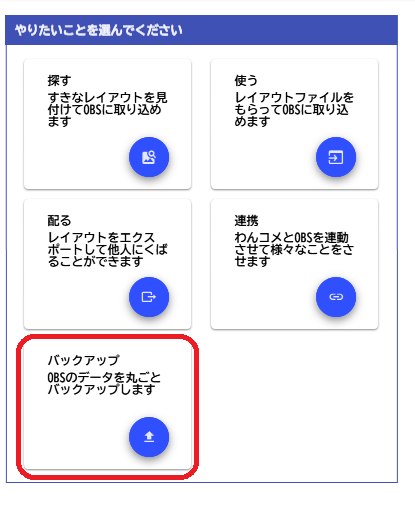
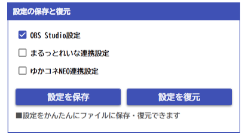

# OBSのバックアップ

!!! Info "OBSのバックアップについて"

    * OBSの設定データをまるっとバックアップします。
    * OBS標準の方法で設定が保存できて入れば、プラグインなどの設定も一緒に保存されます。

## 事前準備

* OBSはバックアップ前に終了させておきます。

## 取り込み方

* バックアップを選びます。

* バックアップを行うか、復元するかを選んでください

!!! Info "バックアップされたファイルについて"

    * 配信に関わるシークレット設定値を含みますので、この設定は他人に配るのを控えることを強く推奨します。個人のＰＣバックアップの１つとして大切に保管してください。
