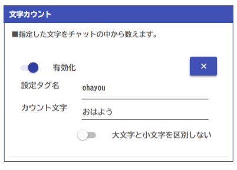
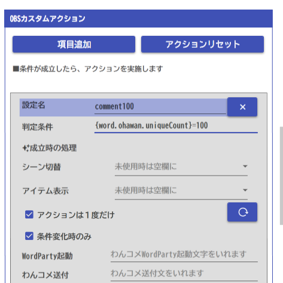
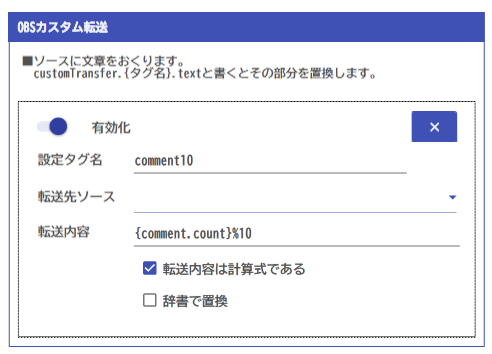

## 攻略チートシートについて

* このチートシートはテーマを絞ってガイドする「攻略本」的なものです。

## やりたいこと

* あいさつ（例：おはわん） 100 人目の名前を表示します

## 設定

* まるっとれいなで文字を数えるためのタグをつくります

* まるっとれいなでどういうときにアクションを起こすか設定します。

* 転送先をいれます。`{action.comment100.user.name}`タグは、上のアクションが実行されたときのチャットユーザの名前を拾います。

