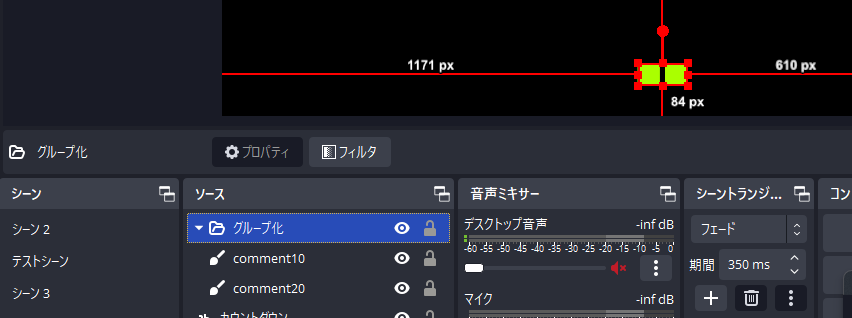
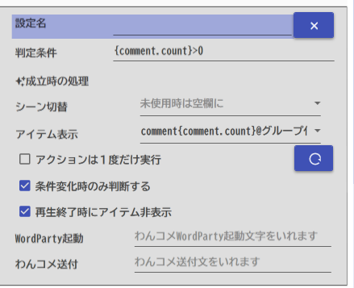

## 攻略チートシートについて

* このチートシートはテーマを絞ってガイドする「攻略本」的なものです。

## やりたいこと

* コメントに応じて表示を増やします。

## 設定

* OBSに下記の設定をします。

ソース名の末尾部分には、敷居となる数字をいれます。

* まるっとれいなに下記の設定をします。

!!! Info "アイテム名にタグを使うのがポイントです"

    * `'comment{comment.count}@グループ化'の`{comment.count}`の部分がコメント数に応じて置き換わり、該当するソースがある場合に処理されるという仕組みです

* 設定がうまくいくと、コメントが10個、20個来たときにゲージとなる枠が表示されていきます。
