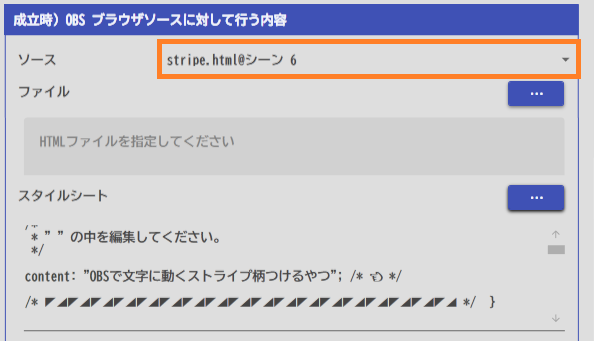
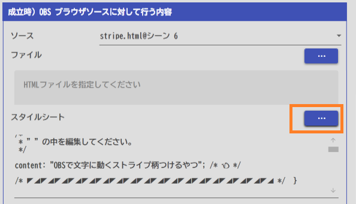
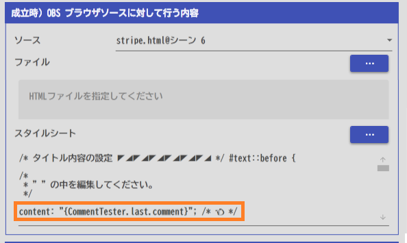
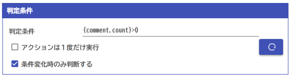

## 攻略チートシートについて

* このチートシートはテーマを絞ってガイドする「攻略本」的なものです。

## やりたいこと

* 表示する文字をかっこよくします

## 謝辞

* [蓬莱軒](https://twitter.com/HoraiChan)さんのテンプレートを題材として活用させていただいております

* テンプレートは[こちら](https://twitter.com/HoraiChan/status/1704830149479547055?s=20)から入手できます。

## 設定

1. テンプレートは[こちら](https://twitter.com/HoraiChan/status/1704830149479547055?s=20)から入手し、ファイルをすきなフォルダに展開します。

2. OBSに自分が使いたいレイアウトのhtmlファイルを貼りつけます。

3. れいなのアクション画面でソース名を選びます。

4. スタイルシートを読み込みます。

5. 文を入れるところにタグをいれます。

* タグはリストから選んでいれます。例ではコメントテスターの最終文になっていますが、配信の文を取り込むためには、別のタグを使います（例：{#.last.comment}）

6. 更新条件を設定します

* コメントがくるたびにだすなら、'{comment.count}>0'と入れます。

これで、コメントが来るたびに表示がきれいにでます。

