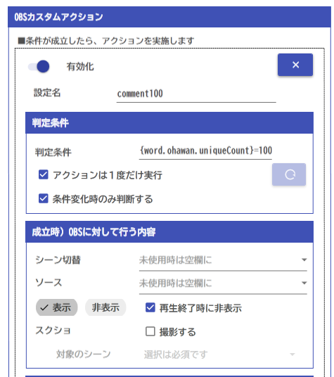

## 攻略チートシートについて

* このチートシートはテーマを絞ってガイドする「攻略本」的なものです。

## やりたいこと

* あいさつに反応するようにします。

## 設定

* まるっとれいなに下記の設定をします。

計算式は、`'{CommentTester.last.comment}' LIKE '*わん*' AND {comment.count}>0` のようにします。

!!! Info "環境によってタグは変わります"

    * `'{CommentTester.last.comment}'の`CommentTester`の部分はご自分の配信枠によって異なります。

!!! Info "`{comment.count}>0`を入れる意味"

    * 「条件変化時のみ」にチェックを入れないとコメントがある間すべて反応してしまいますが、チェックを入れた場合は「条件式に変化がない場合」1度しか反応しません。
    * この場合、別視聴者が立て続けに「おはわん」といれたとしても式には変化がおきないため反応を得られません。
    * そのため、式に変化が起こるように、コメント毎に状態が変わる式を追加しておきます。

* OBSに下記の設定をします。

* わんコメに下記の設定をします。

* 設定がうまくいくと、挨拶がある度にメディアが再生されます。
