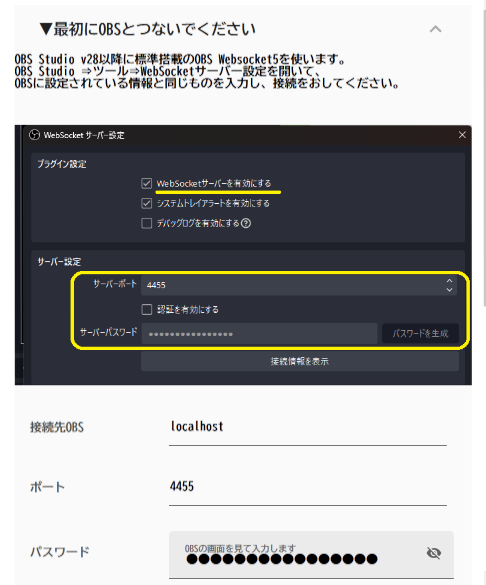
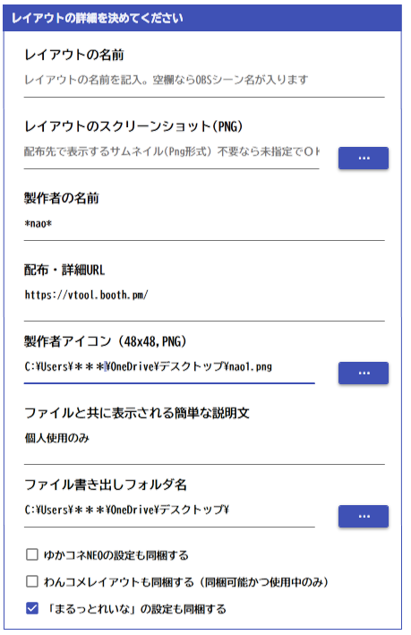

# レイアウトを渡す

!!! Info "レイアウトファイルについて"

    * ファイルの最後が「.layouts」になっているものがレイアウトファイルです。
    * ファイルの中には設定、画像、わんコメテンプレートなどが格納されています。

## 事前準備

* ゆかコネNEOの設定を転送するには、ゆかコネを先立ち上げておいて、「翻訳/連携プラグイン」をONにしておく必要があります

## 書き出し方

* レイアウトを配るを選びます。

* OBS と接続します。

!!! Info "OBS接続について"

    * 通信には、OBS v28以降に標準搭載されているWebsocketを使います。
    * OBS→ツール→WebSocketサーバ設定をひらいて有効化します。
    * 設定画面にあるポート番号、パスワードをいれます。

* テンプレートファイルの素性を入力します。

* OBSに転送を始めます

