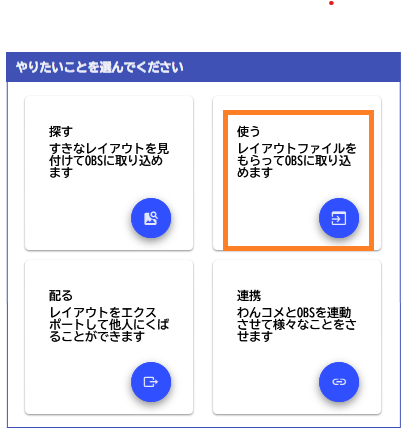
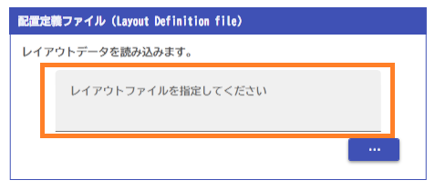
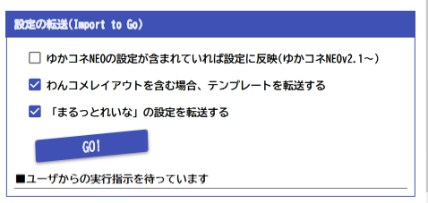

# レイアウトを使う

!!! Info "レイアウトファイルについて"

    * ファイルの最後が「.layouts」になっているものがレイアウトファイルです。
    * ファイルの中には設定、画像、わんコメテンプレートなどが格納されています。

## 事前準備

* ファイルは booth などの素材配布サイトから入手してください

## 取り込み方

* レイアウトを使うを選びます。

* OBS と接続します。

!!! Info "OBS接続について"

    * 通信には、OBS v28以降に標準搭載されているWebsocketを使います。
    * OBS→ツール→WebSocketサーバ設定をひらいて有効化します。
    * 設定画面にあるポート番号、パスワードをいれます。

* テンプレートファイルを読み込みます

* OBSに転送を始めます

!!! Info "連携について"

    * ゆかコネNEOの設定を転送するには、ゆかコネを先立ち上げておいて、「翻訳/連携プラグイン」をONにしておく必要があります

