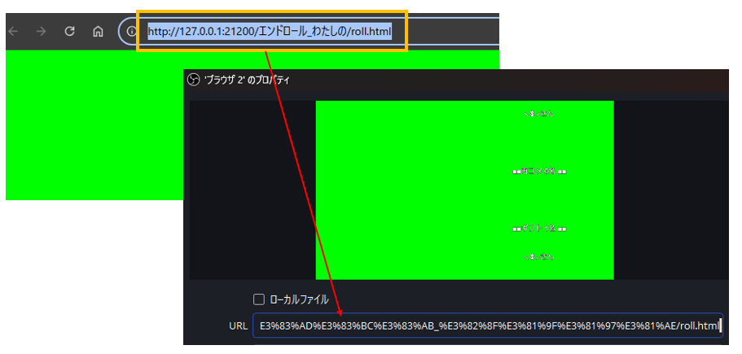

# エンドロール

!!! Info "エンドロールについて"

    * OBSに読み込ませることで、即席エンドロールが表示できます
    * わんコメとの連動が必要です 
    * 最新のまるっとれいなをご利用ください。

## 概要

わんコメで取得しているデータを活用し、即席＆リアルタイムでエンドロールを生成できます。配信の最後に、リスナーさんに感謝の気持ちを伝える方法として活用できます。

## 設定方法

### 1.わんコメの設定

まずは、わんコメで自分のｃｈにつなぎます。
（便宜上、今回の枠名は twicas とします）

### 2. 接続

わんコメにつなぎます。

### 3.仮表示

テロップ画面をみながら、どのテロップをベースにするか考えます
（ダブルクリックするとブラウザが開き、エンドロールが表示されます。それをみてベースを考えます）

### 4.加工用にコピー

ベースファイルをきめたら、フォルダを開いて加工用にコピーをしましょう

### 5.メモ帳で開く

中にあるファイルを、メモ帳などでひらきます

### 6.枠名を設定

エンドロールの時間、それから1️⃣の枠名を入れます

### 7.書き換える

エンドロール文を自分の好みに書き換えたり、使わない行は消したりしましょう（これが表示されるエンドロールになります）

### 8.再読み込み

編集が終わったら保存し、れいなの方で読み込み直します。
うまくいけば、ファイル名がでるはずです。

### 9.OBS取り込み

その名前をダブルクリックするとエンドロールがでるはずなので表示されているアドレスをOBSにセットすれば完了です。

### 10.OBSオプション設定

OBS側でこのチェックを入れておけば、きっと幸せになれます

## その他のエンドロールレイアウト

|フォルダ名      | 中身                      | 
|----------------|---------------------------|
|エンドロール    |映画の最後に出るような感じで表示されます|
|シンプル        |左にタイトル、右に内容が表示されます|
|エンドロール静画あり|OBSのスクリーンショットで取った写真を左側に、情報が右側にでます。ポイント利用時にスクショを取るなどをしながら、配信の振り返りに使うとかっこよくなります|
|エンドロール動画あり|リプレイバッファを左側にながし、情報を右側にながします。(OBS内のブラウザでは動画が表示できないことがあります。その場合は別途ブラウザで開いて画面を取り込んでください)|
