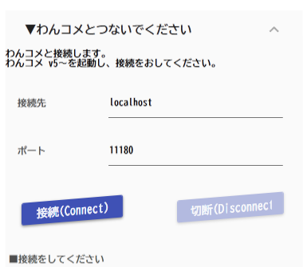
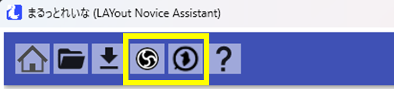

# 連携させる

!!! Info "[わんコメ](https://onecomme.com/)について"

    * 対応している[わんコメ](https://onecomme.com/)のバージョンは v5です。

## 事前準備

* [わんコメ](https://onecomme.com/)と[OBS Studio](https://obsproject.com/)を起動します。

## 初期設定

* 連携を選びます。

* OBS Studioと接続します。

* わんコメと接続します

## 設定が終わった後

* 一度設定がおわれば、次からは画面上のボタンを押すだけで接続が完了します。

