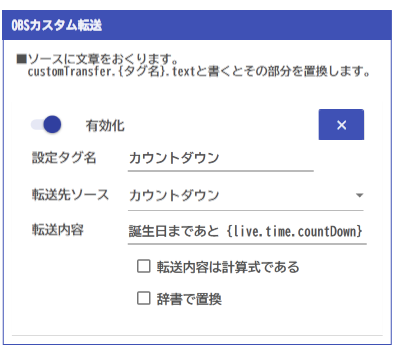
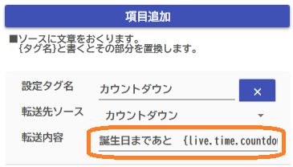

# 設定方法

!!! Info "連携機能について"
    わんコメやＯＢＳの設定・機能をうまく使うことでフル発揮できるように出来ています。
    連動しない場合は出来ることが減ります。

## 用語解説

* 「タグ名」とは、まるっとれいなが持っている情報をあらわす名前になります。100以上の種類がありますので、解説を見ながら必要になりそうなものを見つけてください。

* タグ一覧は、連携画面の右側に表示されます。

## 基本的な転送パターン

* OBSへの転送パターンはいくつかあります。

### 1. ソース名に指定するパターン

* OBSのソース名にタグ名を入れることで、直接その情報をＯＢＳに表示する方法です。

### 2. まるっとれいな側で指定する方法

* OBSのソース名にタグ名を入れることで、直接その情報をＯＢＳに表示する方法です。

## 処理対象

### チャット処理対象

!!! Info "対象について"
    正規表現が利用できます。正規表現を使うことで、複数のパターンに反応できるようになります。

!!! Info "使い方"
    翻訳botなどのコメントを除外する場合に使います。

* ＩＤ、名前に指定した文字があればチャットとして処理しません。

## 機能

### カウントダウン

* 指定した時間をターゲットとしてカウントダウンをします。
* 24時間以上の場合も、日ではなく時間として表示されます。（例：29:12:20）

* タグは `live.time.countdown` になります。

### 文字カウント

!!! Info "カウント文字について"
    正規表現が利用できます。正規表現を使うことで、複数のパターンに反応できるようになります。

* チャットに指定した文字を数えられます。

* 数えた結果は `word.（タグ名）.count` で取得できます。

### OBSカスタム転送

* 指定したOBSソースに指定した文章を送ります。
* 転送内容、転送先ソース名にはタグが利用可能です。

### OBSカスタムアクション

* 条件が成立したらアクションを実施します
* 判定条件には数式、タグが利用可能です
* シーン名、アイテム名、わんコメ送付文にはタグが利用可能です。

|項目|中身|
|---|-----|
|設定名|このアクションの名前。タグにも使われます|
|判定条件|タグと計算式が使えます。成立するとアクションが走ります|
|シーン切り替え|OBSのシーンを指定のものに切り替えます|
|アイテム表示|OBSの指定ソースを表示します（未成立時は非表示にします）|
|アクションは一度だけ|1度だけ反応します|
|条件変化時のみ|条件が以前と変わったときに評価します|
|再生終了時にアイテム非表示|再生が終わったらアイテムを非表示にします|
|WordParty起動|WordPartyのアクションを起動します|
|わんコメ送付|わんコメのチャットに送ります|

!!! Info "わんコメ送付について"
    わんコメの枠に送る場合には、枠名を`Layna`としてください。まるっとれいなは、この枠名を検知してチャットを送るようになります。

    

!!! Info "アクションリセット"
    アクションが行われるとこのボタンが押せるようになります。「アクションは1度だけ」となっている場合は、このボタンを押すことで再度アクションが行えるようになります。

    

!!! Info "条件成立時"
    条件が成立したら、`action.(タグ名).user.name`と`action.(タグ名).user.comment`が記録されます。

    

## ソースについて

* ソースには文字以外にも指定ができます。

|種類|文字を指定したときの転送先|
|---|-----|
|テキスト|表示されるテキスト|
|ブラウザ|ＵＲＬ・ファイル名|
|メディア|ファイル名|
