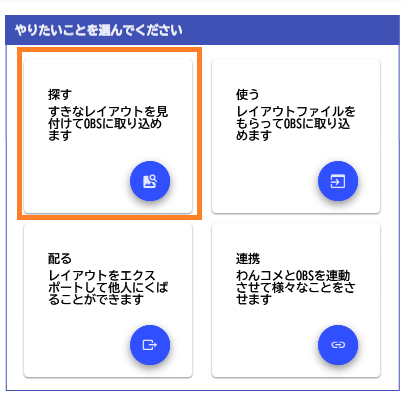
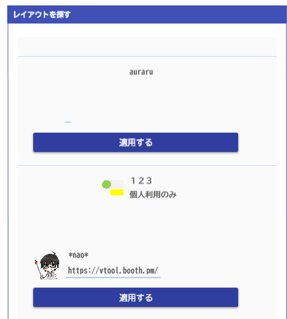

# レイアウトを使う

!!! Info "レイアウトファイルについて"

    * 一度読み込まれたテンプレートデータは、個人フォルダ内に展開され保存されています。
    * OBSからレイアウトを使う場合はこのフォルダを参照するように設定されます。

## 事前準備

* ファイルを使う手順に従って取り込んでいない場合は何も表示されません

## 取り込み方

* レイアウトを探すを選びます。

* デザインを選びます

* [デザインを使う](import.md)の画面がでますので、取り込んで使用してください。